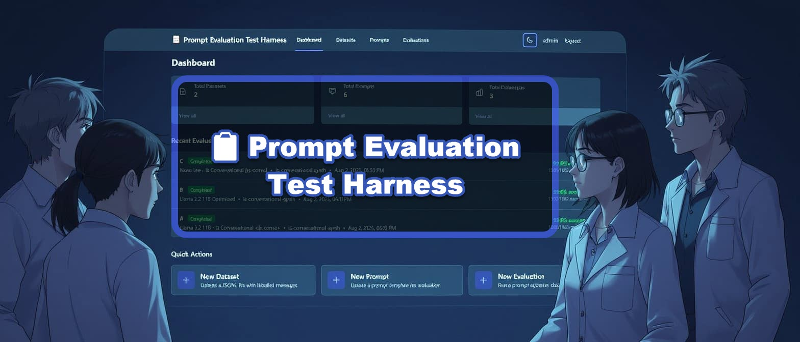

# 📋 Prompt Evaluation Test Harness

A web application for systematically evaluating and optimizing LLM prompts against labeled datasets.

[](https://www.youtube.com/watch?v=9iP204UFNec)

## Features

- Upload labeled datasets in JSONL format
- Create and version prompts with configurable parameters
- Run automated evaluations against datasets
- View detailed metrics (accuracy, precision, recall, F1 score)
- Collaborative team features with secure data management

## Tech Stack

- **Backend**: Node.js, Express.js, SQLite, JWT Authentication
- **Frontend**: Vue.js 3, Vite, Tailwind CSS, Pinia
- **LLM Integration**: AWS Bedrock via bedrock-wrapper

## Prerequisites

- Node.js 18+ 
- AWS credentials configured for Bedrock access

## Fresh Installation

Follow these steps for a brand new deployment:

1. **Clone the repository**
   ```bash
   git clone <repository-url>
   cd prompt-eval-test-harness
   ```

2. **Install dependencies**
   ```bash
   # Install root dependencies
   npm install
   
   # Install client dependencies
   cd client
   npm install
   cd ..
   ```

3. **Configure environment variables**
   - Create a `.env` file in the root directory
   - Add your AWS credentials for Bedrock access:
     ```
     AWS_ACCESS_KEY_ID=your_access_key
     AWS_SECRET_ACCESS_KEY=your_secret_key
     AWS_REGION=us-east-1
     ```
   - Optional: Set custom database path with `DB_PATH=/path/to/database.sqlite`

4. **Initialize the database**
   ```bash
   npm run setup-db
   ```
   This creates a new SQLite database file (`database.sqlite`) with all required tables and schema.

5. **Start the application**
   ```bash
   # Development mode (starts both frontend and backend with automatic port cleanup)
   npm start
   ```

6. **Access the application**
   - Frontend: http://localhost:5173 (development)
   - Backend API: http://localhost:4444/api
   - Health check: http://localhost:4444/api/health

### First Time Setup
- The database will be created automatically when you run `npm run setup-db`
- No sample data is included - you'll need to:
  1. Register a new user account
  2. Upload your first dataset
  3. Create your first prompt

## Project Structure

```
prompt-eval-test-harness/
├── server/                 # Backend Express.js application
│   ├── config/            # Database and app configuration
│   ├── middleware/        # Express middleware
│   ├── modules/           # Feature modules (auth, datasets, etc.)
│   ├── services/          # Shared services
│   ├── utils/            # Utility functions
│   └── scripts/          # Database migrations
├── client/                # Frontend Vue.js application
│   ├── src/
│   │   ├── components/   # Vue components
│   │   ├── views/       # Page components
│   │   ├── router/      # Vue Router config
│   │   ├── stores/      # Pinia state stores
│   │   └── services/    # API client
│   └── public/          # Static assets
├── database.sqlite       # SQLite database file
└── logs/                # Application logs
```

## Usage

1. **Register/Login**: Create an account or login
2. **Create Dataset**: Upload a JSONL file with labeled messages
3. **Create Prompt**: Design a prompt template with classification instructions
4. **Run Evaluation**: Test the prompt against your dataset
5. **View Results**: Analyze metrics and iterate on your prompt

## JSONL Format Example

```json
{"messageContent": "Hi, when will my order arrive?", "label": true}
{"messageContent": "Payment processed for $49.99", "label": false}
```

## Development

### Development Commands

```bash
# Start both frontend and backend in development mode (with automatic port cleanup)
npm start

# Run tests
npm test                 # All tests
npm run test:ui         # Tests with UI
npm run test:coverage   # Generate coverage report

# Database operations
npm run setup-db        # Initialize/reset database
```

### Building for Production

```bash
# Build complete production bundle (includes frontend build, server files, and optimized .env)
npm run build

# The built files will be in dist/ directory with:
# - dist/client/ - Built frontend files
# - dist/server/ - Server application
# - dist/.env - Production environment variables (development-only vars removed)
# - dist/package.json - Production package.json
```

### Production Deployment

1. **Build the production bundle**
   ```bash
   npm run build
   ```

2. **Deploy the dist/ directory**
   ```bash
   cd dist
   npm install --omit=dev
   npm start
   ```

The production build process:
- Builds the frontend with Vite (includes tree shaking and optimization)
- Copies server files to `dist/server/`
- Creates optimized `dist/.env` (removes development-only variables like `CLIENT_PORT`)
- Generates production `package.json` with only necessary dependencies

The production server will:
- Automatically kill any processes using port 4444 before starting
- Serve the built frontend files from `dist/client/`
- Run the API on the configured PORT (default: 4444)
- Use graceful shutdown handling

### Environment Variables

| Variable | Description | Default | Production |
|----------|-------------|---------|------------|
| PORT | Backend server port | 4444 | |
| CLIENT_PORT | Frontend dev server port | 5173 | (dev only) |
| JWT_SECRET | Secret key for JWT tokens | (required) | |
| DB_PATH | Path to SQLite database | ./database.sqlite | |
| AWS_ACCESS_KEY_ID | AWS credentials for Bedrock | (required) | |
| AWS_SECRET_ACCESS_KEY | AWS credentials for Bedrock | (required) | |
| AWS_REGION | AWS region | us-east-1 | |
| MAX_FILE_SIZE_MB | Maximum upload file size | 150 | |
| LOG_LEVEL | Logging level | debug | |

**Note**: The production build automatically excludes development-only variables (like `CLIENT_PORT`) from the `dist/.env` file.
